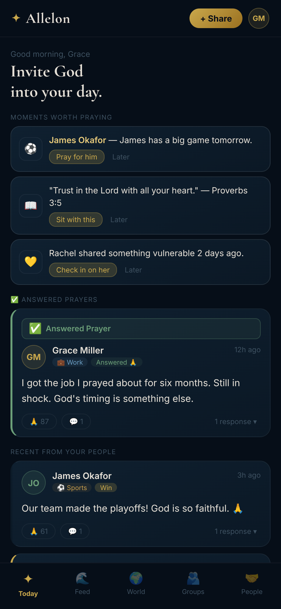
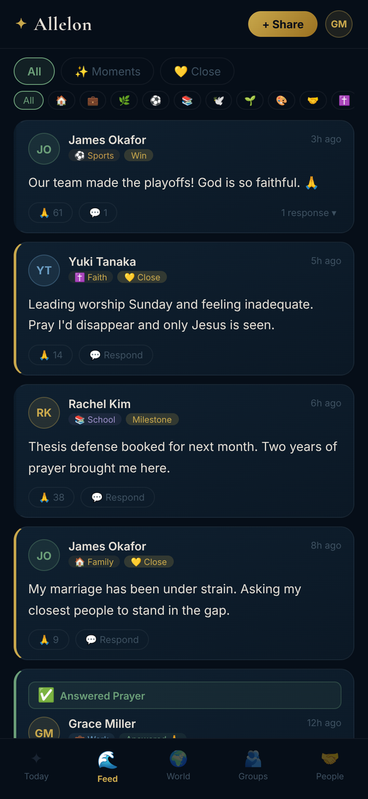
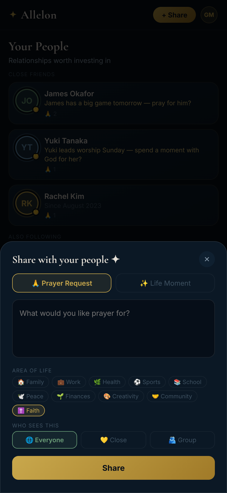
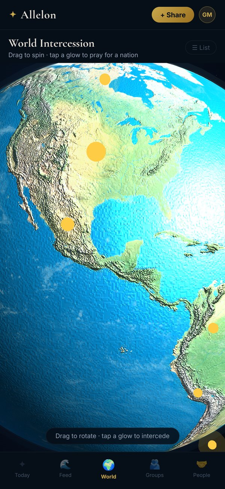
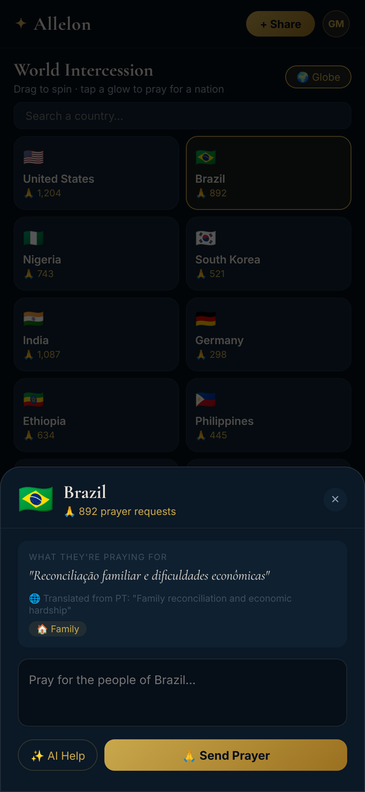
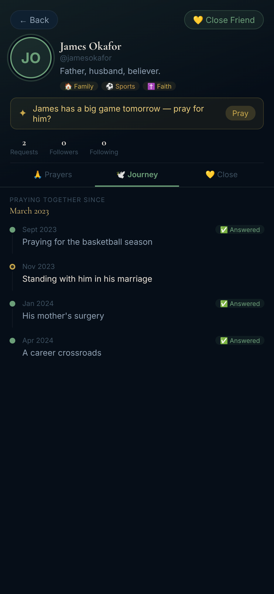
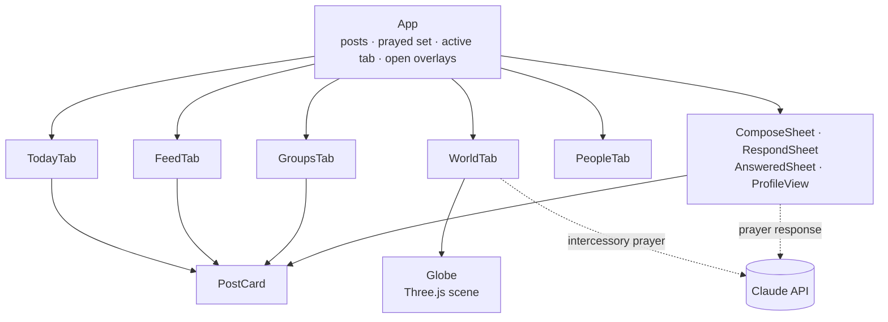

<div align="center">

# ✦ Allelon

**A prayer-centered social network for sharing life with the people who pray for you.**

Post prayer requests and life moments, choose exactly who sees them,<br>
and keep a record of everything you've prayed through together.

[](https://react.dev)
[](https://threejs.org)
[](https://docs.anthropic.com)
[](#roadmap)

[About](#about) · [Features](#features) · [Screenshots](#screenshots) · [Getting started](#getting-started) · [Architecture](#architecture) · [Roadmap](#roadmap)

</div>

---

## About

*Allelon* (ἀλλήλων) is Greek for "one another," the word James uses when he writes *pray for one another* (James 5:16).

Allelon began as the vision of **Allie Bates**, a close friend of the author: a social platform built for Christians, where prayer requests can be posted and answered, privately or publicly, as each person chooses. This repository holds the working prototype of that idea.

Where most social apps are built for reach, Allelon is built for closeness. Every post has an audience you choose, every prayer is one tap, answered prayers become testimonies, and the people you pray with regularly get a shared history you can look back on.

## Features

### Today
- **Moments worth praying:** daily nudges such as a friend's big game, a verse to sit with, or a check-in on someone who shared something vulnerable. Each can be set aside with *Later*.
- **Answered prayers** get their own section, followed by the latest posts from your people.

### Feed
- Two kinds of post: **Prayer Requests** and **Life Moments**, labeled *Win*, *Moment*, *Milestone*, *Struggle*, *Gratitude* or *Answered*.
- Ten **areas of life** to tag and filter by: Family, Work, Health, Sports, School, Peace, Finances, Creativity, Community and Faith.
- Filter by **All**, **Moments** or **Close**.
- **Pray** with one tap (tap again to undo), or **respond in prayer** with a written reply that can be public or private.
- Authors can **mark a request answered** and attach an optional testimony. Answered posts are highlighted across the app.

### World Intercession
- An interactive **3D globe** with 25 nations. Each glowing marker is sized by that nation's prayer volume.
- Drag to rotate, tap a marker to open the nation, or switch to a searchable **list view**.
- Each nation shows its current prayer focus. Prayers written in another language are shown in the original with an English translation.
- Write a prayer for the nation, with optional AI help drafting it.

### Groups
- Shared prayer spaces for the communities you belong to, such as a Bible study, a sports team or a worship team.
- Posts shared to a group are visible only to its members.

### People and profiles
- **Close friends** are listed apart from everyone else you follow, each with a timely nudge or how long you've prayed together.
- Profiles show a person's areas of life, their posts, and their close-friends posts when you're in their circle.
- **Journey** is a timeline of everything you and a friend have prayed for together since you connected, with answered prayers marked along the way.

### AI-assisted prayer
- When responding to a post or praying for a nation, the **✨ AI** button asks Claude for a short, scripture-grounded prayer.
- Suggestions are only a starting point. You choose *Use this*, edit it, and send it yourself. Nothing is posted automatically.

## Privacy model

Allelon's core promise is that you decide who sees what.

| Audience | Who sees the post |
| --- | --- |
| 🌐 **Everyone** | Anyone on Allelon |
| 💛 **Close** | Only the people on your close-friends list |
| 🫂 **Group** | Only members of the group you choose |

Prayer responses can be sent as 🌐 **Public** or 🔒 **Private**. Posts are color-coded by audience: gold for close friends, the group's color for group posts, and green once a prayer is answered.

> In the prototype, these rules are applied in the browser against sample data. A production version will need to enforce them on the server.

## Screenshots

<table>
  <tr>
    <td align="center" width="33%"><br><sub><b>Today</b>: nudges and answered prayers</sub></td>
    <td align="center" width="33%"><br><sub><b>Feed</b>: requests and life moments</sub></td>
    <td align="center" width="33%"><br><sub><b>Share</b>: choose type, area and audience</sub></td>
  </tr>
  <tr>
    <td align="center"><br><sub><b>World</b>: the intercession globe</sub></td>
    <td align="center"><br><sub><b>Nation</b>: original text and translation</sub></td>
    <td align="center"><br><sub><b>Journey</b>: a shared prayer history</sub></td>
  </tr>
</table>

<sub>All screens show the prototype's built-in sample data.</sub>

## Tech stack

| Layer | Choice |
| --- | --- |
| UI | React function components and hooks, styled with inline styles from a single theme object |
| 3D globe | [Three.js](https://threejs.org) r128, loaded at runtime from cdnjs |
| Globe imagery | Earth, elevation, water and cloud textures from [turban/webgl-earth](https://github.com/turban/webgl-earth), based on NASA Blue Marble imagery |
| AI | [Anthropic Messages API](https://docs.anthropic.com/en/api/messages) using `claude-sonnet-4-6` |
| Typography | [Cormorant Garamond](https://fonts.google.com/specimen/Cormorant+Garamond) for display text, [Inter](https://fonts.google.com/specimen/Inter) for UI |
| Data | In-memory sample data; no backend yet |

## Getting started

The prototype is a single React component, `allelon.jsx`, with no npm dependencies beyond React. The quickest way to run it is inside a fresh [Vite](https://vite.dev) project.

**Prerequisites:** Node.js 20.19 or newer, and an internet connection (Three.js, the globe textures and the fonts load from the web at runtime).

```bash
# 1. Get the code
git clone https://github.com/RyanKeleher/Allelon.git

# 2. Create a React app next to it and install dependencies
npm create vite@latest allelon-app -- --template react
cd allelon-app
npm install

# 3. Copy the prototype into the app
cp ../Allelon/allelon.jsx src/
```

Then replace the contents of `src/main.jsx` with:

```jsx
import { StrictMode } from 'react'
import { createRoot } from 'react-dom/client'
import App from './allelon.jsx'

createRoot(document.getElementById('root')).render(
  <StrictMode>
    <App />
  </StrictMode>,
)
```

This drops the template's `index.css` import; Allelon ships its own global styles.

```bash
# 4. Start the dev server
npm run dev
```

Open the local URL Vite prints (usually http://localhost:5173). Allelon is designed for phones and caps its layout at 500 px, so it looks best with your browser's device toolbar set to a mobile size.

> [!NOTE]
> **About the AI features.** The prototype calls `https://api.anthropic.com/v1/messages` directly from the browser without an API key, the pattern used by AI-powered Claude artifacts, where Claude authenticates the request. In a standalone build those requests are rejected, so the ✨ AI buttons won't return a suggestion. Everything else works. A server-side proxy that holds the API key is on the [roadmap](#roadmap).

## Architecture

The whole prototype lives in `allelon.jsx`. The root `App` component owns the shared state and passes data and handlers down; the tabs and overlays keep only local UI state, such as form input and AI suggestions.



### State and data flow
- `App` holds `posts`, the set of posts you've prayed for, the active tab, and which overlay is open.
- Post data changes only through four handlers in `App`: `onPray`, `onPost`, `onRespond` and `onMarkAnswered`. Tabs receive the data plus callbacks that open the respond, answered and profile overlays, which in turn call those handlers.
- Visibility is computed at render time: the feed and profile views filter posts by audience, close-friends lists and group membership.
- State is in memory, so a page refresh resets to the sample data.

### The globe
- The Three.js scene is created once when the World tab mounts and fully disposed of when it unmounts, including the renderer and every event listener.
- The earth is a textured sphere with bump and specular maps, a cloud layer that drifts on its own, an atmosphere shell, a starfield, and warm and cool directional lights.
- Nation markers are placed by converting latitude and longitude to 3D coordinates. Taps are resolved with raycasting, and drags are filtered out so they don't register as taps.
- Rotation eases toward its target for smooth dragging, and the globe resumes spinning on its own after three seconds idle.
- A progress ring tracks texture loading. The globe appears as soon as the first texture arrives, with a six-second fallback.
- **Strict-mode safety:** React never mutates Three.js objects. The selected nation is mirrored into a ref, and all per-frame changes (marker pulse, highlight color) happen inside the `requestAnimationFrame` loop, which avoids the read-only property errors React strict mode can otherwise trigger.

### Code map

`allelon.jsx` is organized into banner-commented sections, in this order:

| Section | Contents |
| --- | --- |
| Theme and sample data | Color tokens (`C`), areas of life, the 25 nations, sample users, groups, posts, shared prayer histories and daily nudges |
| Shared UI | `Avi` (avatar), `Tag` (area of life), `Pill` (toggle button), `Sheet` (bottom sheet) |
| Globe | The Three.js globe component |
| World tab | Globe and list views, the nation sheet, and AI prayer drafting |
| Post card | A single request or moment with pray, respond and answered actions |
| Sheets | Compose, respond and mark-answered flows |
| Profile view | Profile header with Prayers, Journey and Close tabs |
| Tabs | Today, Feed, Groups and People |
| Root | `App`: state, handlers, header and bottom navigation |

### Data model

A post, as stored in `posts`:

| Field | Type | Description |
| --- | --- | --- |
| `id` | number | Unique ID |
| `authorId` | string | The posting user |
| `type` | `"request"` \| `"moment"` | Prayer request or life moment |
| `passion` | string | Area of life, such as `"family"` or `"faith"` |
| `audience` | `"all"` \| `"close"` \| `"group"` | Who can see the post |
| `groupId` | string \| null | Target group when `audience` is `"group"` |
| `text` | string | Post body |
| `momentLabel` | string \| null | *Win*, *Milestone* and so on, for moments |
| `prayerCount` | number | How many people have prayed |
| `responses` | array | Replies: `{ id, authorId, text, time, private }` |
| `time` | string | Display timestamp |
| `answered` | boolean | Whether the prayer has been marked answered |
| `answeredText` | string \| null | The author's optional testimony |

### Design language
- **Palette:** deep navy surfaces (`#060e18`), gold accents for prayer and close friends (`#c9a84c`), sage for answered prayers (`#6b9e78`), and lavender for private replies (`#9b8fc8`).
- **Type:** Cormorant Garamond for headings gives a reverent, editorial tone; Inter keeps the interface clear at small sizes.
- **Layout:** mobile-first, with bottom-sheet overlays and a five-tab bottom navigation.

## Project structure

```
Allelon/
├── allelon.jsx            # The complete prototype: data, components, globe and root app
├── docs/
│   └── screenshots/       # Images used in this README
└── README.md
```

## Roadmap

- [x] Interactive prototype covering all five tabs
- [x] 3D World Intercession globe
- [x] AI-assisted prayer drafting
- [ ] Persistent backend with user accounts (Supabase)
- [ ] Server-side proxy for AI requests, so no API key ever reaches the client
- [ ] Wire up the actions that are placeholders today: creating a group, following someone, and the *Pray* and *Check in* nudge buttons
- [ ] Native mobile app built with React Native and Expo
- [ ] Beta through TestFlight, then release on the App Store and Google Play

## Acknowledgments

- **Allie Bates**, whose vision for a prayer-centered community started Allelon.
- [turban/webgl-earth](https://github.com/turban/webgl-earth) for the globe textures, and NASA for the Blue Marble imagery behind them.
- [Three.js](https://threejs.org), [Anthropic](https://www.anthropic.com), and the designers of Cormorant Garamond and Inter.

## License

No license has been chosen yet, so all rights are reserved by default. If you'd like to use or contribute to this code, please open an issue first.

---

<div align="center">
<sub>Built by <a href="https://github.com/RyanKeleher">Ryan Keleher</a>, inspired by Allie Bates.</sub>
</div>
